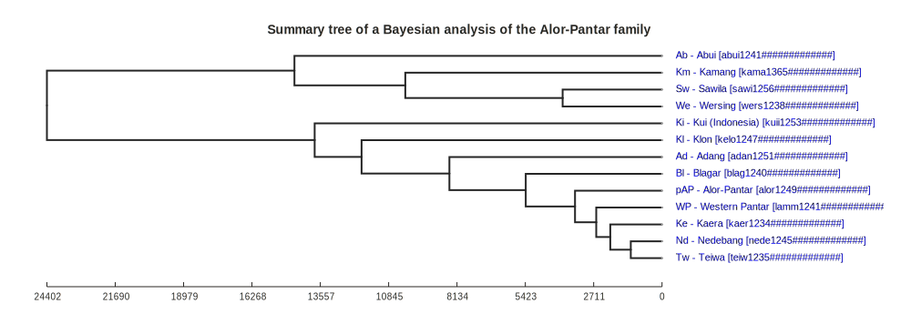

# Dataset robinson_and_holton2012

## How to cite

If you use these data please cite
- the original source
  > Robinson, L. C., & Holton, G. (2012). Internal Classification of the Alor-Pantar Language Family Using Computational Methods Applied to the Lexicon. Language Dynamics and Change, 2(2), 123–149. doi:10.1163/22105832-20120201
- the derived dataset using the DOI of the [particular released version](../../releases/) you were using

## Description

Available online at https://dx.doi.org/10.1163/22105832-20120201

## CLDF Datasets

The following CLDF datasets are available in [cldf](cldf):

- CLDF [Generic](https://github.com/cldf/cldf/tree/master/modules/Generic) at [cldf/Generic-metadata.json](cldf/Generic-metadata.json)

## Summary Tree

